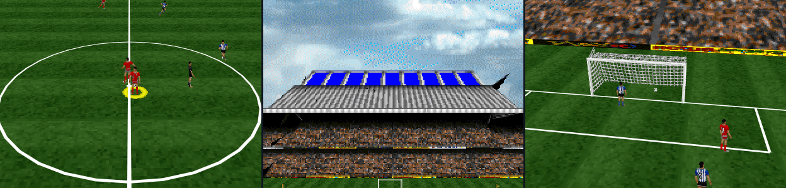

# cssSoccer ⚽

A source-backed port of [Actua Soccer](https://github.com/Xrampino/Actua-Soccer) that renders a complete Spain vs Argentina match as real HTML/CSS 3D geometry through [PolyCSS](https://github.com/LayoutitStudio/polycss), without a WebGL or canvas renderer. cssSoccer prepares the original source and game data into browser-ready assets, then runs the match in JavaScript.

The current Full Match Alpha lets you control either team through two one-minute halves representing a complete 90-minute friendly. It includes live movement, passing, shooting, tackling, goals, restarts, fouls, offside, halftime, full time, pause, and rematch. It is a focused playable match, not the complete Actua Soccer game.



## How to Play

Use Node.js 20.19+ or 22.12+ and pnpm 10.33. The original source and game data are not stored in Git; place the pinned local inputs described in `references/spain-argentina-source-data.json`, then prepare the browser assets once:

```sh
pnpm install --frozen-lockfile
pnpm source:setup
pnpm prepare:cssoccer
```

After the assets exist, run the local dev server:

```sh
pnpm dev
```

Choose Spain or Argentina in the opening screen. Use W/A/S/D to move, J to shoot or tackle, and K to pass, sprint, or steal. Arrow keys and Z provide the classic control layout, touch controls appear on coarse-pointer devices, Escape pauses, and Enter confirms.

`pnpm build` builds the Vite app from the prepared assets. Run `pnpm prepare:cssoccer` again only when the source inputs or preparation code change.

## How It Works

cssSoccer uses [PolyCSS](https://github.com/LayoutitStudio/polycss) to turn the pitch, stadium, players, officials, and ball into real DOM elements positioned with CSS `matrix3d(...)` transforms. The match is not drawn to a `<canvas>`.

The browser loads one manifest-driven scene from `build/generated/public/cssoccer/`. It does not parse the original source archives or construct geometry while the game is running. Generated browser assets are intentionally ignored by Git.

## Build and Runtime

The prepare step reads pinned Actua Soccer source and data, builds geometry and texture atlases, merges topology, packages animation, and writes deterministic browser assets under `build/generated/public/cssoccer/`.

JavaScript owns the browser match loop, input, camera, players, goalkeepers, ball, rules, score, HUD, and PolyCSS DOM updates. Original source, game data, native builds, captures, and generated assets remain local and are not published in this repository.

The exact Full Match Alpha scope and exclusions are recorded in `references/full-match-alpha.md`.

## License

cssSoccer code is [MIT licensed](LICENSE). Actua Soccer source, game data, and assets are not included and remain subject to their own terms.
